# SyncingSteel System - User Workflow Flowchart

## Overview
This document provides detailed workflow flowcharts for all user roles in the SyncingSteel System, showing how different types of users interact with the system modules.

## User Roles
1. **Superadmin** - Oversees all server, system, and deployment management. Full access to system settings, logs, metrics, and user/role management. Can invite Admin Officers and initialize system onboarding.
2. **Admin Officer / Office Admin** - Handles HRIS configuration, onboarding, and high-level HR operations. Can manage all modules except system/server settings.
3. **HR Staff** - Human resources personnel managing employees
4. **Accounting Staff** - Finance team managing payroll and finances
5. **Office Staff** - Regular employees with self-service access

---

## Complete System Workflow

---

## Superadmin Workflow

---

## Admin Officer / Office Admin Workflow

---

## HR Staff Workflow

```mermaid
graph TD
    HRLogin([HR Staff Login]) --> HRDash[HR Staff Dashboard]
    HRDash --> ManageCandidates[Manage Candidates & Interviews]
    HRDash --> RunOnboarding[Start Onboarding Tasks]
    HRDash --> ManageWorkforce[Manage Schedules & Rotations]
    
    HRDash --> HREmployees[Employee Management]
    HRDash --> HRLeave[Leave Management]
    HRDash --> HRRecruitment[Recruitment]
    HRDash --> HRPerformance[Performance Reviews]
    HRDash --> HRReports[HR Reports]
    
    %% Employee Management
    HREmployees --> HREmployeeActions{Select Action}
    HREmployeeActions --> ViewAllEmployees[View All Employees]
    HREmployeeActions --> AddNewEmployee[Add New Employee]
    HREmployeeActions --> UpdateEmployee[Update Employee Info]
    HREmployeeActions --> DeleteEmployee[Delete/Archive Employee]
    HREmployeeActions --> ManageDocuments[Generate/Print/Send Documents]
    
    %% Rolling Mills Management
    ViewAllEmployees --> FilterRollingMills[Filter: Rolling Mills Department]
    FilterRollingMills --> ViewRMEmployees[View Rolling Mills Employees]
    AddNewEmployee --> AddRMEmployee{Add to Which Department?}
    AddRMEmployee -->|Rolling Mills| AddRMForm[Fill Rolling Mills Employee Form]
    AddRMEmployee -->|Other| HREmployeeForm[Fill Employee Form]
    AddRMForm --> SaveRMEmployee[Save Rolling Mills Employee Record]
    SaveRMEmployee --> RMEmployeeEnd([Rolling Mills Employee Added])
    HREmployeeForm --> SaveEmployeeRecord[Save Employee Record]
    SaveEmployeeRecord --> EmployeeEnd([Employee Added])
    
    UpdateEmployee --> UpdateRMEmployee{Update Which Department?}
    UpdateRMEmployee -->|Rolling Mills| UpdateRMForm[Update Rolling Mills Employee Info]
    UpdateRMEmployee -->|Other| UpdateEmployeeForm[Update Employee Info]
    UpdateRMForm --> SaveRMUpdate[Save Changes]
    SaveRMUpdate --> RMUpdateEnd([Rolling Mills Employee Updated])
    UpdateEmployeeForm --> SaveUpdate[Save Changes]
    SaveUpdate --> UpdateEnd([Employee Updated])
    
    DeleteEmployee --> DeleteRMEmployee{Delete From Which Department?}
    DeleteRMEmployee -->|Rolling Mills| ConfirmDeleteRM[Confirm Delete]
    DeleteRMEmployee -->|Other| ConfirmDelete[Confirm Delete]
    ConfirmDeleteRM --> ArchiveRMEmployee[Archive Rolling Mills Employee]
    ArchiveRMEmployee --> RMDeleteEnd([Rolling Mills Employee Archived])
    ConfirmDelete --> ArchiveEmployee[Archive Employee]
    ArchiveEmployee --> DeleteEnd([Employee Archived])
    
    ManageDocuments --> SelectDocType{Select Document Type}
    SelectDocType --> ContractDoc[Employment Contract]
    SelectDocType --> CertificateDoc[Certificate]
    SelectDocType --> PayslipDoc[Payslip]
    SelectDocType --> OtherDoc[Other Document]
    ContractDoc --> PrintContract[Print/Send Contract]
    CertificateDoc --> PrintCertificate[Print/Send Certificate]
    PayslipDoc --> PrintPayslip[Print/Send Payslip]
    OtherDoc --> PrintOtherDoc[Print/Send Document]
    PrintContract --> DocEnd([Document Generated])
    PrintCertificate --> DocEnd
    PrintPayslip --> DocEnd
    PrintOtherDoc --> DocEnd
    
    %% Leave Management
    HRLeave --> LeaveActions{Select Action}
    LeaveActions --> ViewLeaveRequests[View Leave Requests]
    LeaveActions --> ApproveLeave[Approve/Reject Leave]
    LeaveActions --> ManageLeaveBalances[Manage Leave Balances]
    LeaveActions --> ViewLeaveHistory[View Leave History]
    
    ViewLeaveRequests --> SelectRequest[Select Leave Request]
    SelectRequest --> ReviewRequest[Review Request Details]
    ReviewRequest --> CheckBalance{Check Leave Balance}
    CheckBalance -->|Sufficient| ApproveDecision{Approve or Reject?}
    CheckBalance -->|Insufficient| AutoReject[Auto-Reject - Insufficient Balance]
    ApproveDecision -->|Approve| ApproveRequest[Approve Leave Request]
    ApproveDecision -->|Reject| RejectRequest[Reject with Reason]
    ApproveRequest --> UpdateBalance[Update Leave Balance]
    UpdateBalance --> NotifyEmployee[Notify Employee]
    RejectRequest --> NotifyEmployee
    AutoReject --> NotifyEmployee
    NotifyEmployee --> LeaveEnd([Leave Request Processed])
    
    ManageLeaveBalances --> LeaveEnd
    ViewLeaveHistory --> LeaveEnd
    
    %% Recruitment
    HRRecruitment --> RecruitmentActions{Select Action}
    RecruitmentActions --> ManageJobPostings[Manage Job Postings]
    RecruitmentActions --> ReviewApplications[Review Applications]
    RecruitmentActions --> ScheduleInterviews[Schedule Interviews]
    RecruitmentActions --> ManageOffers[Manage Job Offers]
    
    ReviewApplications --> SelectApplication[Select Application]
    SelectApplication --> EvaluateCandidate[Evaluate Candidate]
    EvaluateCandidate --> CandidateDecision{Decision}
    CandidateDecision -->|Interview| ScheduleInterview[Schedule Interview]
    CandidateDecision -->|Reject| RejectCandidate[Send Rejection Email]
    ScheduleInterview --> RegisterVisitorAppt[Register as Visitor]
    RegisterVisitorAppt --> RecruitmentEnd([Process Complete])
    RejectCandidate --> RecruitmentEnd
    
    ManageJobPostings --> RecruitmentEnd
    ScheduleInterviews --> RecruitmentEnd
    ManageOffers --> RecruitmentEnd
    
    %% Performance Reviews
    HRPerformance --> HRPerfActions{Select Action}
    HRPerfActions --> InitiateReview[Initiate Review Cycle]
    HRPerfActions --> MonitorProgress[Monitor Review Progress]
    HRPerfActions --> ViewPerfReports[View Performance Reports]
    
    InitiateReview --> SelectReviewPeriod[Select Review Period]
    SelectReviewPeriod --> SelectEmployeesReview[Select Employees]
    SelectEmployeesReview --> AssignReviewers[Assign Reviewers]
    AssignReviewers --> SendNotifications[Send Review Notifications]
    SendNotifications --> HRPerfEnd([Review Cycle Started])
    
    MonitorProgress --> HRPerfEnd
    ViewPerfReports --> HRPerfEnd
    
    %% HR Reports
    HRReports --> HRReportType{Select Report}
    HRReportType --> HeadcountReport[Headcount Report]
    HRReportType --> TurnoverReport[Turnover Report]
    HRReportType --> LeaveReport[Leave Utilization Report]
    HRReportType --> DemographicsReport[Demographics Report]
    
    HeadcountReport --> SelectDept[Select Department/Period]
    TurnoverReport --> SelectDept
    LeaveReport --> SelectDept
    DemographicsReport --> SelectDept
    
    SelectDept --> GenerateHRReport[Generate Report]
    GenerateHRReport --> ExportHRReport{Export Format}
    ExportHRReport --> ExportPDF1[PDF]
    ExportHRReport --> ExportExcel1[Excel]
    ExportPDF1 --> HRReportEnd([Report Generated])
    ExportExcel1 --> HRReportEnd

```

---

## Accounting Staff Workflow

---

## Office Staff (Regular Employee) Workflow

---

## Leave Request Approval Workflow (Multi-Level)

---

## Payroll Processing Complete Workflow

```mermaid
graph TD
    StartPayroll([Start Payroll Period]) --> CreatePeriod2[Create Payroll Period]
    CreatePeriod2 --> SetDates[Set Period Dates]
    SetDates --> SetPayDate[Set Pay Date]
    SetPayDate --> LockPeriod[Lock Previous Period]
    
    LockPeriod --> FetchData[Fetch Data Sources]
    FetchData --> GetAttendance[Get Attendance Data]
    GetAttendance --> GetLeave[Get Leave Data]
    GetLeave --> GetOvertime[Get Overtime Data]
    GetOvertime --> GetSalaryInfo[Get Salary Information]
    
    GetSalaryInfo --> ValidateData2{Data Complete?}
    ValidateData2 -->|No| NotifyHR[Notify HR - Missing Data]
    ValidateData2 -->|Yes| StartCalculation[Start Calculation]
    NotifyHR --> WaitData[Wait for Data Completion]
    WaitData --> ValidateData2
    
    StartCalculation --> LoopEmployees[Loop Through Employees]
    LoopEmployees --> CalcBasicSalary[Calculate Basic Salary]
    CalcBasicSalary --> CalcDays[Calculate Days Worked]
    CalcDays --> CalcHours[Calculate Hours Worked]
    CalcHours --> CalcOT[Calculate Overtime Pay]
    CalcOT --> CalcNightDiff[Calculate Night Differential]
    CalcNightDiff --> CalcHolidayPay[Calculate Holiday Pay]
    CalcHolidayPay --> CalcLeaveCredits[Calculate Leave Credits]
    
    CalcLeaveCredits --> GrossPay[Calculate Gross Pay]
    GrossPay --> StartDeductions[Calculate Deductions]
    
    StartDeductions --> CalcSSS[Calculate SSS Contribution]
    CalcSSS --> CalcPhilHealth2[Calculate PhilHealth]
    CalcPhilHealth2 --> CalcPagIBIG2[Calculate Pag-IBIG]
    CalcPagIBIG2 --> CalcTax[Calculate Withholding Tax]
    CalcTax --> CalcLoans[Calculate Loan Deductions]
    CalcLoans --> CalcOtherDeductions[Calculate Other Deductions]
    
    CalcOtherDeductions --> TotalDeductions[Total Deductions]
    TotalDeductions --> CalcNet[Calculate Net Pay]
    
    CalcNet --> MoreEmployees{More Employees?}
    MoreEmployees -->|Yes| LoopEmployees
    MoreEmployees -->|No| GenerateSummary[Generate Summary Report]
    
    GenerateSummary --> AccountingReview[Accounting Reviews]
    AccountingReview --> ReviewOK{Review Status}
    ReviewOK -->|Issues| IdentifyIssues[Identify Issues]
    ReviewOK -->|Approved| HRReview3[HR Manager Reviews]
    IdentifyIssues --> CorrectIssues[Correct Issues]
    CorrectIssues --> StartCalculation
    
    HRReview3 --> HRApproval{HR Approval}
    HRApproval -->|Reject| CorrectIssues
    HRApproval -->|Approve| FinalReview[Finance Manager Reviews]
    
    FinalReview --> FinalApproval2{Final Approval}
    FinalApproval2 -->|Reject| CorrectIssues
    FinalApproval2 -->|Approve| GeneratePayslips2[Generate Payslips]
    
    GeneratePayslips2 --> EmailPayslips[Email Payslips to Employees]
    EmailPayslips --> PrepareBankFile[Prepare Bank Transfer File]
    PrepareBankFile --> ProcessTransfers[Process Bank Transfers]
    ProcessTransfers --> VerifyTransfers[Verify Transfers]
    
    VerifyTransfers --> UpdateRecords[Update Payroll Records]
    UpdateRecords --> ClosePeriod[Close Payroll Period]
    ClosePeriod --> ArchiveData[Archive Payroll Data]
    ArchiveData --> PayrollCompleted([Payroll Period Completed])

```

---

## System Access Control Matrix

| Module | Superadmin | Admin Officer | HR Staff | Accounting | Office Staff |
|--------|------------|--------------|----------|------------|--------------|
| **System Management** | Full Access | No Access | No Access | No Access | No Access |
| **User Management** | Full Access | Full Access | View Only | No Access | No Access |
| **Employee Management** | Full Access | Full Access | Full Access | View Only | View Own |
| **Timekeeping** | Full Access | Full Access | Full Access | View Only | View Own |
| **Payroll** | Full Access | Full Access | View Only | Full Access | View Own Payslip |
| **Reports** | Full Access | Full Access | HR Reports | Financial Reports | Own Reports |
| **Visitors** | Full Access | Full Access | Full Access | No Access | No Access |
| **Performance** | Full Access | Full Access | Full Access | View Only | View Own |
| **Leave Management** | Full Access | Full Access | Full Access | View Only | Submit Requests |

---

## Key Workflow Notes

### Authentication & Authorization
- All users must be authenticated before accessing the system
- Role-based access control (RBAC) determines available features
- Admins can perform all actions across all modules
- Staff users have limited access to self-service features

### Data Flow
- **HR Module** → Provides employee data to all modules
- **Timekeeping Module** → Provides attendance data to Payroll
- **Payroll Module** → Uses data from HR and Timekeeping
- **Reports Module** → Aggregates data from all modules

### Approval Workflows
- Leave requests require supervisor approval
- Payroll requires multi-level approval (Accounting → HR → Finance)
- Employee updates require HR approval
- Performance reviews require manager submission and HR acknowledgment

### Notifications
- Email notifications sent for leave approvals/rejections
- Payslips automatically emailed to employees
- Performance review notifications sent to reviewers
- System alerts for pending approvals

---

**Document Version:** 1.0  
**Last Updated:** October 6, 2025  
**Related Documents:**
- [System Architecture Plan](SYNCINGSTEEL_ARCHITECTURE_PLAN.md)
- [Database Schema](DATABASE_SCHEMA.md)
- [HR Module Architecture](HR_MODULE_ARCHITECTURE.md)
- [Timekeeping Module Architecture](TIMEKEEPING_MODULE_ARCHITECTURE.md)
- [Payroll Module Architecture](PAYROLL_MODULE_ARCHITECTURE.md)
